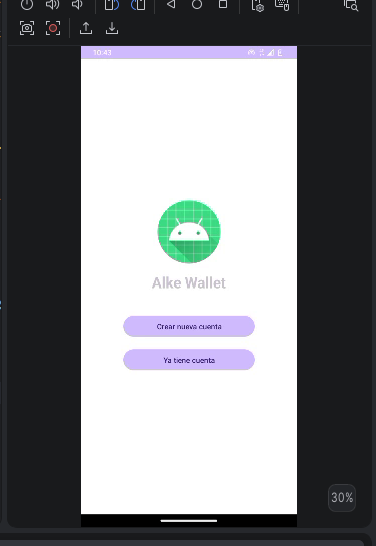
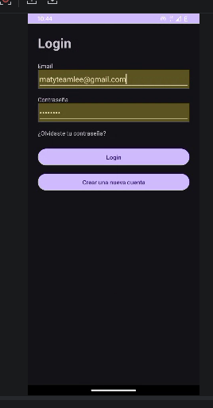
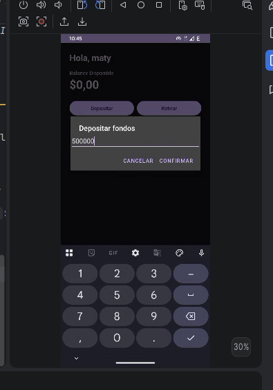
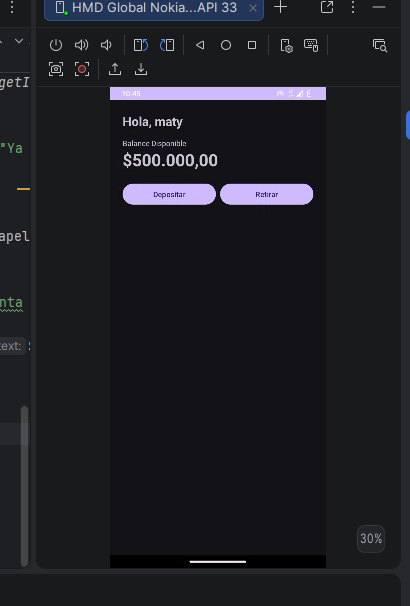
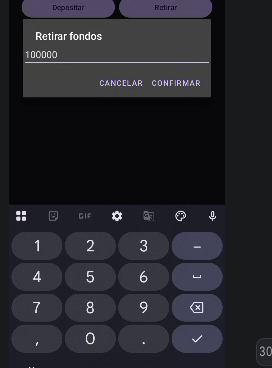
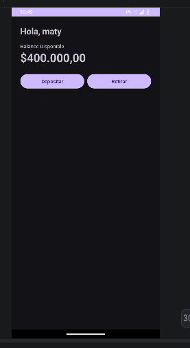

# Alke Wallet Mobile - Módulo 5

## Objetivo del proyecto

Desarrollar una billetera digital que permita a los usuarios gestionar sus
activos financieros de manera segura y conveniente, cumpliendo el
requerimiento general de la consigna del Módulo 5: administración de fondos.

## Tecnologías

- Android Studio
- Java
- XML
- Android SDK

## Requerimiento funcional implementado (consigna Módulo 5)

- Ver saldo disponible.
- Realizar depósitos de fondos.
- Realizar retiros de fondos.

## Patrón de diseño (MVC)

- **Model** (`com.alkewallet.model`): `User`, `Account` — datos y lógica de
  negocio de depósito/retiro con sus validaciones.
- **Controller** (Activities): `LoginActivity`, `SignupActivity`,
  `HomeActivity` — manejan la interacción del usuario y actualizan el Modelo.
- **View** (XML): `activity_login.xml`, `activity_signup.xml`,
  `activity_home.xml`.

## Pantallas desarrolladas

- Login / Signup (pantalla de bienvenida)
- Login
- Signup
- Home (saldo disponible, depositar, retirar)

## Componentes Android utilizados

- Activities
- Intents
- AlertDialog
- ScrollView / LinearLayout
- TextView, EditText, Button
- Toast (mensajes de éxito/error)

## Evidencias

### Sección 1 - Pantalla de bienvenida (Login / Signup)

#### Requerimiento implementado

Punto de entrada de la app: el usuario elige entre iniciar sesión o crear una
cuenta nueva.

#### Elementos implementados

- Logo de la aplicación.
- Nombre de la aplicación.
- Botón "Crear nueva cuenta".
- Botón "Ya tiene cuenta".

---

### Sección 2 - Login

#### Requerimiento implementado

Autenticación del usuario contra los datos guardados en `UserRepository`.

#### Elementos implementados

- Campo Email.
- Campo Contraseña.
- Botón Login.
- Botón para crear una nueva cuenta.

#### Componentes Android utilizados

- TextView, EditText, Button, ScrollView

---

### Sección 3 - Depósito de fondos

#### Requerimiento implementado

Cumple textualmente lo pedido por la consigna: *"realizar depósitos de
fondos"*. Se muestra el diálogo (`AlertDialog`) donde el usuario ingresa el
monto a depositar.

#### Componentes Android utilizados

- AlertDialog, EditText (numérico), Button

---

### Sección 4 - Saldo actualizado tras el depósito

#### Requerimiento implementado

Cumple *"ver su saldo disponible"*: el balance se recalcula en tiempo real
tras el depósito ($500.000,00) y se muestra en la pantalla Home.

---

### Sección 5 - Retiro de fondos

#### Requerimiento implementado

Cumple *"realizar retiros de fondos"*. Diálogo de ingreso de monto a retirar,
con validación de saldo suficiente en la clase `Account`.

---

### Sección 6 - Saldo actualizado tras el retiro

#### Requerimiento implementado

Saldo final reflejando el retiro realizado ($400.000,00), confirmando que la
lógica de negocio (`Account.deposit()` / `Account.withdraw()`) funciona
correctamente y se refleja en la vista.

---

## Resultado

La aplicación permite a un usuario logueado ver su saldo disponible y
modificarlo mediante depósitos y retiros de fondos, cumpliendo el
requerimiento general de administración de fondos pedido por la consigna del
Módulo 5.

## Entregable

Código fuente subido a GitHub, mostrando la vista de la wallet (`HomeActivity`
+ `activity_home.xml`) con saldo, depósito y retiro funcionando.